# ElasticJob 底层实现原理深度源码分析

> 本文基于 ElasticJob `3.0.5`/`3.1.0-SNAPSHOT` 源码深入分析，所有结论均来自真实源码，并标注了关键文件路径与行号。
> 源码根目录：`/Users/wenbin/Desktop/workspace/java_projects/source_code/shardingsphere-elasticjob`

---

## 目录

- [一、项目概览与模块架构](#一项目概览与模块架构)
- [二、整体工作流程](#二整体工作流程)
- [三、ZooKeeper 数据结构（核心基础）](#三zookeeper-数据结构核心基础)
- [四、选主流程](#四选主流程)
- [五、通信架构与通信机制](#五通信架构与通信机制)
- [六、任务的定时触发机制](#六任务的定时触发机制)
- [七、分片任务实现原理](#七分片任务实现原理)
- [八、如何保证同一时刻只有一个节点执行](#八如何保证同一时刻只有一个节点执行)
- [九、故障失效转移流程](#九故障失效转移流程)
- [十、协调服务 ReconcileService](#十协调服务-reconcileservice)
- [十一、其他底层实现补充](#十一其他底层实现补充)
- [十二、源码事实纠正与注意事项](#十二源码事实纠正与注意事项)
- [附录：关键源码文件索引](#附录关键源码文件索引)

---

## 一、项目概览与模块架构

### 1.1 ElasticJob 是什么

ElasticJob 是一个**分布式调度解决方案**，由 ShardingSphere 团队开源。它在 Quartz 单机调度能力之上，借助 ZooKeeper 构建了一套**分布式协调机制**，实现了：

- **弹性分片**：将一个作业的数据/任务拆分为多个逻辑分片项，分配到不同节点并行执行，支持水平扩展；
- **高可用**：节点宕机自动选主、自动失效转移、自动重新分片；
- **去中心化协调**：节点间不直接通信，全部通过 ZK 共享状态协调；
- **统一运维**：提供 RESTful 运维接口、作业追踪（Tracing）日志、快照 dump 等能力。

### 1.2 模块划分与职责

ElasticJob 顶层采用 Maven 多模块结构，遵循"依赖倒置 + SPI 解耦"原则。

| 模块 | 职责 | 关键内容 |
|------|------|---------|
| **api** | 纯接口契约层，零业务依赖 | `ElasticJob`、`JobConfiguration`(Builder)、SPI 接口(`JobItemExecutor`/`JobErrorHandler`/`ElasticJobListener`/`TracingListener`)、`ShardingContext`、事件类(`JobExecutionEvent`/`JobStatusTraceEvent`) |
| **registry-center** | 注册中心抽象与实现 | `api` 子模块定义 `CoordinatorRegistryCenter` 接口、监听器接口；`provider/zookeeper-curator` 提供基于 Curator 的 `ZookeeperRegistryCenter` |
| **kernel** | 调度与协调核心（体量最大） | Quartz 封装(`JobScheduler`/`LiteJob`/`JobScheduleController`)、门面(`SchedulerFacade`/`SetUpFacade`/`JobFacade`)、执行器(`ElasticJobExecutor`)、各 Service 子包(config/election/sharding/failover/trigger/...) |
| **bootstrap** | 作业启动入口 | `JobBootstrap` 接口、`ScheduleJobBootstrap`(Cron)、`OneOffJobBootstrap`(一次性) |
| **ecosystem** | 作业类型与生态扩展 | `executor/simple`/`dataflow`/`http`/`script` 四种作业类型、`error-handler`(log/dingtalk/wechat/email)、`tracing/rdb` |
| **lifecycle** | 作业生命周期管理 API | `JobAPIFactory` 暴露 `JobOperateAPI`/`JobConfigurationAPI`/`ShardingOperateAPI`/`JobStatisticsAPI` |
| **restful** | RESTful HTTP 管理接口 | 基于 Netty 的 `RestfulService` |
| **spring** | Spring/Spring Boot 集成 | `core` 提供 AOP 代理类名解析、`namespace` 自定义标签、`boot-starter` 自动装配 |

### 1.3 模块依赖关系

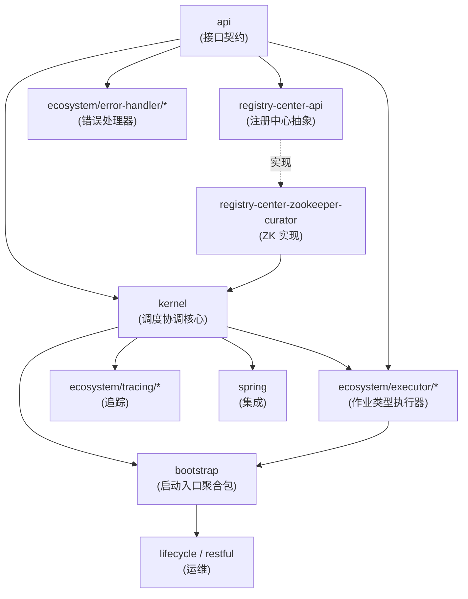

> **关键设计**：`bootstrap/pom.xml` 显式依赖全部四种作业类型执行器和 `elasticjob-error-handler-normal`、`elasticjob-tracing-rdb`，使这些 SPI 实现被打入 classpath，从而被 `ShardingSphereServiceLoader` 自动发现。

### 1.4 核心分层架构

ElasticJob 从上到下分为五层，各层职责清晰、单向依赖：

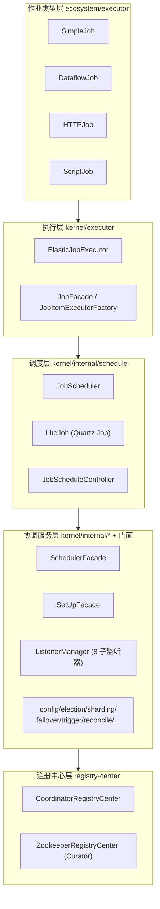

- **作业类型层**：通过 SPI 注册。`SimpleJob`/`DataflowJob` 走 `ClassedJobItemExecutor`（按类匹配），`HTTPJob`/`ScriptJob` 走 `TypedJobItemExecutor`（按 type 字符串匹配）。
- **执行层**：`ElasticJobExecutor` 是执行核心，通过 `JobFacade` 接口与协调服务解耦。
- **调度层**：每个作业独立一个 Quartz `Scheduler`（线程数 1 的 `SimpleThreadPool`），`LiteJob` 实现 `InterruptableJob` 桥接 Quartz 与执行器。
- **协调服务层**：通过门面模式对外暴露，内部组装多个 Service + 8 个子监听器。
- **注册中心层**：`CoordinatorRegistryCenter` 抽象节点 CRUD、临时节点、缓存、分布式锁、事务、监听等能力。

---

## 二、整体工作流程

### 2.1 作业启动流程

以 `ScheduleJobBootstrap.schedule()` 为起点，完整启动调用链如下（`JobScheduler.java:77-196`）：

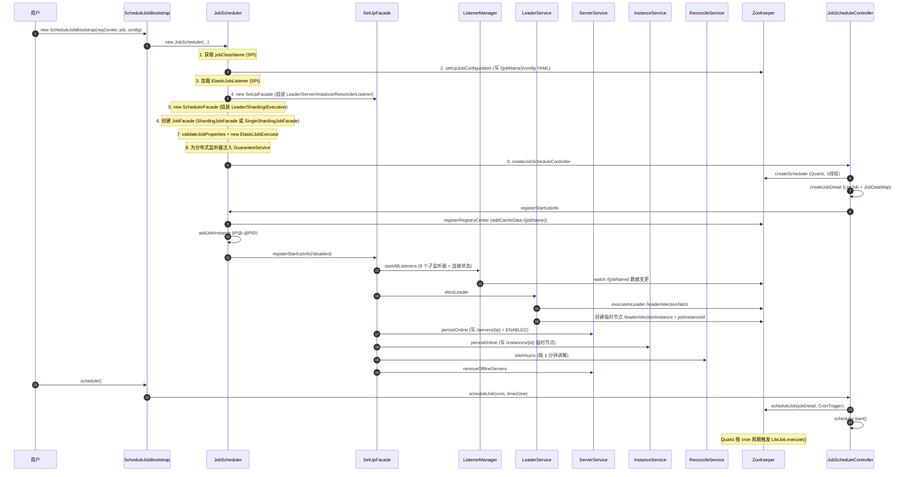

`SetUpFacade.registerStartUpInfo()`（`SetUpFacade.java:70-79`）依次执行：启动全部监听器 → 选主 → 注册 server 在线 → 注册 instance 在线 → 启动 ReconcileService → 清理离线 server。

### 2.2 作业执行流程

Quartz 按 Cron 触发 `LiteJob.execute()`（`LiteJob.java:39-46`），委托给 `ElasticJobExecutor.execute()`（`ElasticJobExecutor.java:85-123`）：

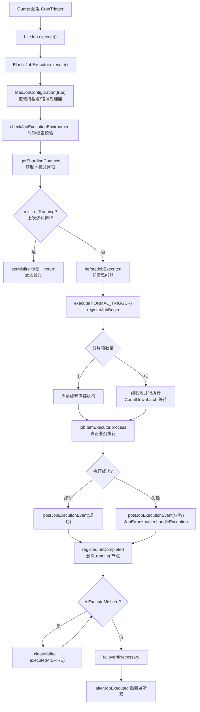

`ElasticJobExecutor` 持有 `jobFacade`（执行门面）、`jobItemExecutor`（具体执行器，SPI）、`executorServiceReloader`（线程池热加载）、`jobErrorHandlerReloader`（错误处理器热加载）。

### 2.3 三个门面（Facade 模式）

| 门面 | 持有的服务 | 职责 |
|------|-----------|------|
| `SchedulerFacade` | Leader/Sharding/Execution | `newJobTriggerListener()`(misfire 监听)、`shutdownInstance()` |
| `SetUpFacade` | Leader/Server/Instance/Reconcile/ListenerManager | `registerStartUpInfo()`(启动注册)、`tearDown()`(关闭清理) |
| `JobFacade` + `AbstractJobFacade` | Config/Sharding/ExecutionContext/Execution/Failover/Tracing/Listener | 为执行器提供统一执行环境，有 `ShardingJobFacade` 和 `SingleShardingJobFacade` 两个实现 |

---

## 三、ZooKeeper 数据结构（核心基础）

ElasticJob 的所有分布式协调都建立在 ZK 之上。理解 ZK 数据结构是理解整个框架的前提。

### 3.1 完整节点树

以 `/{jobName}/` 为根，完整节点结构如下：

```mermaid
graph TD
    ROOT["/{jobName} (持久, 存 jobClassName)"]
    CONFIG["config (持久, YAML 配置)"]
    LEADER["leader (主节点专用区)"]
    ELECTION["leader/election"]
    INST["leader/election/instance<br/>(临时, 主节点 id)"]
    LATCH1["leader/election/latch<br/>(LeaderLatch 选举锁)"]
    SH_LEADER["leader/sharding"]
    NEC["leader/sharding/necessary<br/>(持久, 重分片标记)"]
    PROC["leader/sharding/processing<br/>(临时, 分片进行中)"]
    FAILOVER_LEADER["leader/failover"]
    ITEMS["leader/failover/items/{item}<br/>(持久, 待失效转移项)"]
    LATCH2["leader/failover/latch<br/>(失效转移锁)"]
    SERVERS["servers/{ip} (持久, ENABLED/DISABLED)"]
    INSTANCES["instances/{instanceId}<br/>(临时, 在线实例)"]
    SHARDING["sharding/{item}"]
    S_INST["sharding/{item}/instance<br/>(持久, 归属 id)"]
    S_RUN["sharding/{item}/running<br/>(临时或持久, 运行标记)"]
    S_MIS["sharding/{item}/misfire<br/>(持久, 补偿标记)"]
    S_DIS["sharding/{item}/disabled<br/>(持久, 禁用标记)"]
    S_FO["sharding/{item}/failover<br/>(临时, 失效转移接管标记)"]
    S_FING["sharding/{item}/failovering<br/>(持久, 失效转移执行中)"]
    TRIGGER["trigger/{instanceId}<br/>(持久, 触发标记)"]
    GUARANTEE["guarantee"]
    G_START["guarantee/started/{item}<br/>(持久, 已启动)"]
    G_COMP["guarantee/completed/{item}<br/>(持久, 已完成)"]
    G_LS["guarantee/started-latch (锁)"]
    G_LC["guarantee/completed-latch (锁)"]
    SYS["systemTime/current (注册中心时间)"]
    NEXT["next-job-instance-ip<br/>(临时, 单分片轮转)"]

    ROOT --> CONFIG
    ROOT --> LEADER
    ROOT --> SERVERS
    ROOT --> INSTANCES
    ROOT --> SHARDING
    ROOT --> TRIGGER
    ROOT --> GUARANTEE
    ROOT --> SYS
    ROOT --> NEXT
    LEADER --> ELECTION
    ELECTION --> INST
    ELECTION --> LATCH1
    LEADER --> SH_LEADER
    SH_LEADER --> NEC
    SH_LEADER --> PROC
    LEADER --> FAILOVER_LEADER
    FAILOVER_LEADER --> ITEMS
    FAILOVER_LEADER --> LATCH2
    SHARDING --> S_INST
    SHARDING --> S_RUN
    SHARDING --> S_MIS
    SHARDING --> S_DIS
    SHARDING --> S_FO
    SHARDING --> S_FING
    GUARANTEE --> G_START
    GUARANTEE --> G_COMP
    GUARANTEE --> G_LS
    GUARANTEE --> G_LC
```

### 3.2 节点详细说明表

| 节点路径 | 类型 | 值内容 | 用途 | 来源 |
|---------|------|--------|------|------|
| `/{jobName}` | 持久 | jobClassName | 根节点，冲突检测 | `ConfigurationService.java:77` |
| `/{jobName}/config` | 持久 | YAML(JobConfigurationPOJO) | 完整作业配置 | `ConfigurationService.java:76` |
| `/{jobName}/leader/election/instance` | **临时** | jobInstanceId | 主节点标识 | `LeaderService.java:107` `fillEphemeralJobNode` |
| `/{jobName}/leader/election/latch` | **临时顺序** | LeaderLatch 内部节点 | 选举互斥锁 | `LeaderService.java:52` `executeInLeader` |
| `/{jobName}/leader/sharding/necessary` | 持久 | `""` | 重分片标记 | `ShardingService.java:88` |
| `/{jobName}/leader/sharding/processing` | **临时** | `""` | 分片进行中 | `ShardingService.java:121` |
| `/{jobName}/leader/failover/items/{item}` | 持久 | `""` | 待失效转移队列 | `FailoverService.java:67` |
| `/{jobName}/leader/failover/latch` | **临时顺序** | LeaderLatch 内部节点 | 失效转移锁 | `FailoverService.java:90` |
| `/{jobName}/servers/{ip}` | 持久 | ENABLED/DISABLED | 服务器状态 | `ServerService.java:57` |
| `/{jobName}/instances/{instanceId}` | **临时** | YAML(JobInstance) | 在线实例，下线自动删除 | `InstanceService.java:54` |
| `/{jobName}/sharding/{item}/instance` | 持久 | jobInstanceId | 分片项归属 | `ShardingService.java:161` 事务写入 |
| `/{jobName}/sharding/{item}/running` | **临时或持久** | jobInstanceId | 运行标记；failover=true 持久，否则临时 | `ExecutionService.java:64-68` |
| `/{jobName}/sharding/{item}/misfire` | 持久 | `""` | 补偿执行标记 | `ExecutionService.java:180` |
| `/{jobName}/sharding/{item}/disabled` | 持久 | `""` | 分片项禁用标记 | `ExecutionService.java:220` |
| `/{jobName}/sharding/{item}/failover` | **临时** | jobInstanceId | 失效转移接管标记 | `FailoverService.java:223` `fillEphemeralJobNode` |
| `/{jobName}/sharding/{item}/failovering` | **持久** | jobInstanceId | 失效转移执行中标记 | `FailoverService.java:224` `fillJobNode` |
| `/{jobName}/trigger/{instanceId}` | 持久 | `""` | 手动触发标记 | `InstanceService.java:94` |
| `/{jobName}/guarantee/started/{item}` | 持久 | `""` | 分片已启动 | `GuaranteeService.java:51` |
| `/{jobName}/guarantee/completed/{item}` | 持久 | `""` | 分片已完成 | `GuaranteeService.java:94` |
| `/{jobName}/guarantee/started-latch` | **临时顺序** | LeaderLatch | 最后启动选举锁 | `GuaranteeService.java:138` |
| `/{jobName}/guarantee/completed-latch` | **临时顺序** | LeaderLatch | 最后完成选举锁 | `GuaranteeService.java:150` |
| `/{jobName}/systemTime/current` | - | 时间戳 | 注册中心时间 | `JobNodeStorage.java:233` |
| `/{jobName}/next-job-instance-ip` | **临时** | IP | 单分片轮转下一个执行实例 | `SingleShardingJobFacade.java` |

> **重要纠正**：3.x 版本中**不存在** `/{jobName}/execution/{item}` 节点，执行标记实际存储在 `/{jobName}/sharding/{item}/running`。`sharding/{item}/parameter` 也不作为独立节点，分片参数包含在 `config` 的 YAML 配置中。

### 3.3 JobNodePath 与 JobNodeStorage

- **JobNodePath**（`storage/JobNodePath.java`）：纯路径计算器，将 jobName 前缀与相对路径拼接为完整 ZK 路径。所有 Node 类内部都持有一个 `JobNodePath` 实例。
- **JobNodeStorage**（`storage/JobNodeStorage.java`）：对 `CoordinatorRegistryCenter` 的封装，提供作业级 ZK 操作。

### 3.4 缓存机制（本地缓存 vs 直接读 ZK）

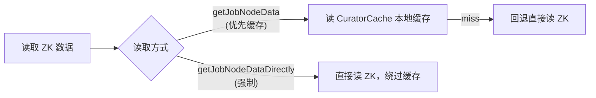

`ConfigurationService.load(fromCache)`（`ConfigurationService.java:49-64`）：`fromCache=true` 先读缓存再回退直接读；`fromCache=false` 强制直接读。缓存在 `JobRegistry.registerRegistryCenter()` 时通过 `regCenter.addCacheData("/" + jobName)` 建立（`JobRegistry.java:70-73`），即对整个 job 根节点建立 `CuratorCache`。

---

## 四、选主流程

### 4.1 选主双层机制

ElasticJob 选主采用**双层机制**：

- **第一层：Curator `LeaderLatch`（互斥锁）** —— 用于"序列化"选主动作，保证同一时刻只有一个节点能执行选主回调；
- **第二层：ZK 临时节点（主节点标记）** —— 在 `/{jobName}/leader/election/instance` 创建临时节点，存储主节点 `jobInstanceId`，作为"谁是主"的持久判定依据。

选主不依赖节点间直接通信，而是通过 ZK 临时节点生命周期（session 级别）+ CuratorCache 数据变更监听实现选举与故障切换。

### 4.2 LeaderService 核心方法

源文件：`kernel/.../election/LeaderService.java`

| 方法 | 行号 | 作用 |
|------|------|------|
| `electLeader()` | `:50-54` | 触发选主，通过 `executeInLeader(LATCH, callback)` 互斥执行 |
| `LeaderElectionExecutionCallback.execute()` | `:101-110` | 获得 latch 后检查 `!hasLeader()`，无主则创建临时节点 `instance` |
| `isLeader()` | `:81-83` | 当前 jobInstanceId 是否等于 `instance` 节点值 |
| `hasLeader()` | `:90-92` | `instance` 节点是否存在 |
| `isLeaderUntilBlock()` | `:65-74` | 阻塞式等待选主完成，分片操作前调用 |
| `removeLeader()` | `:97-99` | 删除 `instance` 节点，触发重新选主 |

`executeInLeader` 底层实现（`ZookeeperRegistryCenter.java:414-424`）：

```java
public void executeInLeader(final String key, final LeaderExecutionCallback callback) {
    try (LeaderLatch latch = new LeaderLatch(client, key)) {
        latch.start();
        latch.await();        // 阻塞直到获得 latch
        callback.execute();   // 执行回调
    } catch (final Exception ex) {
        handleException(ex);
    }
}
```

> **注意**：`LeaderLatch` 是短生命周期的——回调执行完即关闭。真正持久标记主身份的是回调中创建的临时节点 `instance`。`hasLeader()` 检查保证幂等。

### 4.3 选主时序

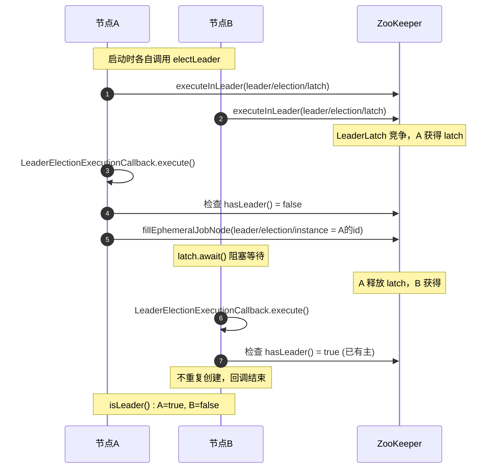

### 4.4 主节点宕机重新选主

`ElectionListenerManager`（`ElectionListenerManager.java:57-102`）注册两个监听器：

- **`LeaderElectionJobListener`**：监听 server 节点变化（主动选举）+ `instance` 节点删除（被动选举 `isPassiveElection`）。
- **`LeaderAbdicationJobListener`**：当前节点是主且本地 server 被 DISABLED 时，调用 `removeLeader()` 让位。

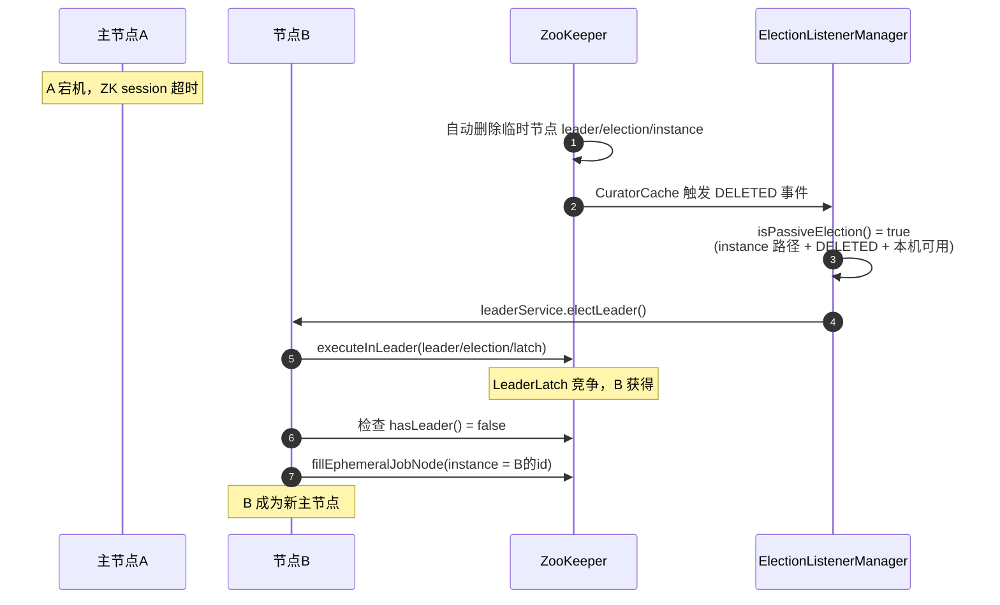

### 4.5 主节点的职责

主节点承担**协调类**职责，非主节点不执行这些操作：

| 操作 | 判定方式 | 文件:行号 |
|------|---------|----------|
| 设置重分片标志 | `isLeaderUntilBlock()` | `ShardingService.java:85` |
| 执行分片 | `isLeaderUntilBlock()` | `ShardingService.java:113` |
| 失效转移分配 | `executeInLeader`(LeaderLatch) | `FailoverService.java:90` |
| 关闭时移除主节点 | `isLeader()` | `SchedulerFacade.java:58` |
| 分布式 once 回调 | `executeInLeader`(LeaderLatch) | `GuaranteeService.java:138,150` |

### 4.6 executeInLeader 机制

`executeInLeader` 在指定 ZK 路径创建临时 `LeaderLatch`，多个节点竞争，第一个获得者执行回调，执行完毕后 latch 自动关闭。使用场景：

| 场景 | latch 路径 | 回调 |
|------|-----------|------|
| Job 选主 | `/{jobName}/leader/election/latch` | `LeaderElectionExecutionCallback` |
| 失效转移 | `/{jobName}/leader/failover/latch` | `FailoverLeaderExecutionCallback` |
| 分布式 once(before) | `/{jobName}/guarantee/started-latch` | `LeaderExecutionCallbackForLastStarted` |
| 分布式 once(after) | `/{jobName}/guarantee/completed-latch` | `LeaderExecutionCallbackForLastCompleted` |

> **补充说明**：`registry-center` 模块还提供了基于 Curator `LeaderSelector` 的 `ZookeeperElectionService`（配合 `ElectionCandidate` 接口），但经全量搜索，**在生产代码中并未被实际使用**，ElasticJob 实际选主走的是 `LeaderService` + `LeaderLatch` + 临时节点这条链路。`ZookeeperElectionService` 是注册中心模块保留的通用选主基础设施。

---

## 五、通信架构与通信机制

### 5.1 基于 ZK Watch 的共享状态通信

ElasticJob 节点间**不直接通信**（没有 RPC、没有消息队列），而是通过 ZooKeeper 实现"通信"：


### 5.2 DataChangedEvent 监听机制

`DataChangedEvent`（`registry-center/api/.../reg/listener/DataChangedEvent.java:28-43`）包含 `type`(ADDED/UPDATED/DELETED/IGNORED)、`key`(ZK 路径)、`value`。

从 Curator 事件到 DataChangedEvent 的转换在 `ZookeeperRegistryCenter.watch()`（`ZookeeperRegistryCenter.java:427-447`）：

| Curator 类型 | DataChangedEvent.Type |
|-------------|----------------------|
| NODE_CREATED | ADDED |
| NODE_DELETED | DELETED |
| NODE_CHANGED | UPDATED |
| 其他 | IGNORED |

Cache 在 `JobRegistry.registerRegistryCenter()` 时通过 `regCenter.addCacheData("/" + jobName)` 建立（`ZookeeperRegistryCenter.java:388-398`），`CuratorCache` 监听该路径下**所有子节点**的创建、更新、删除事件。

### 5.3 ListenerManager 统一管理所有子监听器

`ListenerManager`（`ListenerManager.java:59-86`）是 Facade，在构造时创建 8 个子监听器管理器 + 1 个连接状态监听器，`startAllListeners()` 按顺序启动：

| 子监听器管理器 | 监听内容 | 触发动作 |
|---------------|---------|---------|
| `ElectionListenerManager` | server 节点变化、instance 节点删除 | 选主/让位 |
| `ShardingListenerManager` | config 变化、instance/server 变化 | 设置重分片标志 |
| `FailoverListenerManager` | instance 节点删除、config 变化 | 失效转移 |
| `MonitorExecutionListenerManager` | config 路径变化 | 清理执行信息 |
| `ShutdownListenerManager` | 本机 instance 节点删除 | 触发 shutdown |
| `TriggerListenerManager` | trigger 节点变化 | 触发 job 执行 |
| `RescheduleListenerManager` | config 路径变化 | 重新调度 |
| `GuaranteeListenerManager` | guarantee started/completed 根节点 | 唤醒分布式 once 等待 |

> **关键**：所有 8 个子监听器都注册到同一个 key `/{jobName}` 上，即**共享同一个 CuratorCache**。当 ZK 数据变更时，所有监听器都收到同一个 `DataChangedEvent`，各自根据 `event.getKey()` 和 `event.getType()` 判断是否处理。

每个子监听器继承 `AbstractListenerManager`，通过 `addDataListener()` → `JobNodeStorage.addDataListener()` → `regCenter.watch("/{jobName}", listener, executor)` 注册。

### 5.4 ListenerNotifierManager 异步通知线程池

`ListenerNotifierManager`（`listener/ListenerNotifierManager.java`）是单例（双重检查锁），为每个 job 维护一个独立的 `ExecutorService`：

```java
ExecutorService notifyExecutor = Executors.newSingleThreadExecutor(threadFactory);
```

**关键特性**：
- **每个 job 一个单线程池**——保证同一 job 的所有 DataChangedEvent 回调**串行执行**，避免并发问题；
- 线程名前缀 `ListenerNotify-{jobName}`；
- ZK 数据变更事件通过该线程池异步通知，不阻塞 Curator 的 IO 线程；
- job 关闭时通过 `removeJobNotifyExecutor()` 关闭线程池。

### 5.5 连接状态监听与重连处理

`RegistryCenterConnectionStateListener`（`listener/RegistryCenterConnectionStateListener.java`）实现 `ConnectionStateChangedEventListener`，监听 ZK 连接状态：

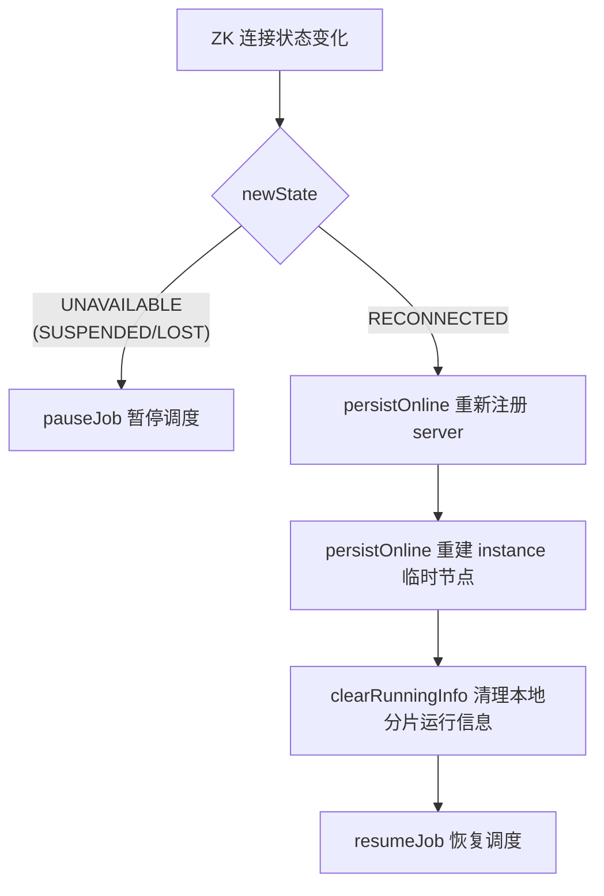

- **UNAVAILABLE**：暂停 Job 调度。因为 ZK 连接断开时，临时节点可能已失效，当前节点可能已不是主节点，继续调度有风险。
- **RECONNECTED**：重连后重建所有临时节点，清理本地分片运行信息（断连期间可能已被重新分配），恢复调度。重连后通过 watch 感知主节点变化触发重新选主。

### 5.6 事务机制

`TransactionOperation`（`registry-center/api/.../base/transaction/TransactionOperation.java`）支持 4 种操作：`CHECK_EXISTS`、`ADD`、`UPDATE`、`DELETE`。

`JobNodeStorage.executeInTransaction()`（`JobNodeStorage.java:185-196`）在事务操作列表前插入 `opCheckExists("/")` 作为 ZK 可用性验证，然后通过 `ZookeeperRegistryCenter.executeInTransaction()`（`ZookeeperRegistryCenter.java:353-385`）用 Curator 事务原子执行。

**核心使用场景**：分片结果写入（`ShardingService.java:124`）——分片分配 + 删除 `necessary` + 删除 `processing` 必须在同一事务中，避免"分片结果写了一半，其他节点看到 necessary 删除就以为分片完成"的竞态。

---

## 六、任务的定时触发机制

### 6.1 Quartz 调度集成

`JobScheduler` 是调度核心入口，每个作业独立创建一个 Quartz Scheduler（`JobScheduler.java:160-171`），关键 Quartz 配置：

| 属性 | 值 | 含义 |
|------|-----|------|
| `org.quartz.threadPool.class` | `SimpleThreadPool` | 单一线程池 |
| `org.quartz.threadPool.threadCount` | `"1"` | **每个作业只有 1 个调度线程** |
| `org.quartz.scheduler.instanceName` | jobName | 以作业名为实例名 |
| `org.quartz.jobStore.misfireThreshold` | `"1"` | misfire 阈值 1ms |
| `org.quartz.plugin.shutdownhook.class` | `JobShutdownHookPlugin` | 关闭钩子插件 |
| `org.quartz.scheduler.interruptJobsOnShutdown` | `true` | 关闭时中断正在执行的作业 |

由于线程数为 1，同一作业的多次触发会串行执行，这也是 misfire 机制存在的前提。

`JobDetail` 绑定 `LiteJob` 类（`JobScheduler.java:185-189`），`LiteJob` 实现 Quartz 的 `InterruptableJob`，`execute()` 委托给 `ElasticJobExecutor.execute()`，真正的执行器通过 `JobDataMap` 注入。

> **源码事实纠正**：源码中**不存在 `triggerInterval` 字段**。`JobConfiguration` 中与定时调度相关的字段只有 `cron` 和 `timeZone`（`JobConfiguration.java:42-44`）。trigger 包实现的并非"定时间隔触发"，而是**基于 ZK 节点的一次性手动触发**机制。

### 6.2 cron 触发

`ScheduleJobBootstrap.schedule()`（`ScheduleJobBootstrap.java:52-55`）要求 cron 非空，调用 `JobScheduleController.scheduleJob(cron, timeZone)`（`JobScheduleController.java:55-64`）：

```
ScheduleJobBootstrap.schedule()
  → JobScheduleController.scheduleJob(cron, tz)
    → createCronTrigger(cron, tz)  // CronTrigger + misfire=DoNothing + 时区
    → scheduler.scheduleJob(jobDetail, trigger)
    → scheduler.start()
```

`createCronTrigger()`（`JobScheduleController.java:97-100`）使用 `CronScheduleBuilder.cronSchedule(cron).inTimeZone(...).withMisfireHandlingInstructionDoNothing()`，错过的触发不做立即补偿，等下一次 cron 时间。

cron 存储在 `/{jobName}/config` 节点的 YAML 配置中。

### 6.3 一次性触发（trigger 包）

trigger 包通过 ZK 节点 `/{jobName}/trigger/{instanceId}` 实现**一次性手动触发**，用于 OneOff 作业和外部 API 触发。

**TriggerService**（`TriggerService.java:26-43`）只负责删除触发标记（`removeTriggerFlag`），不负责创建。

**TriggerListenerManager**（`TriggerListenerManager.java:30-64`）监听本机触发节点的 `ADDED` 事件：

```java
if (!triggerNode.isLocalTriggerPath(event.getKey()) || Type.ADDED != event.getType()) {
    return;
}
triggerService.removeTriggerFlag();
if (!isShutdown && !isJobRunning) {
    JobRegistry.getInstance().getJobScheduleController(jobName).triggerJob();
}
```

逻辑：只有本机 instanceId 的触发节点被新增时才处理 → 删除触发节点（避免重复触发）→ 若作业未 shutdown 且**未运行**则调用 `triggerJob()`。**若作业正在运行则忽略本次触发**（源码注释 TODO 表明未来支持堆叠触发）。

**trigger 与 cron 的关系**：两者是**并列的两种触发模式**（一个作业要么 cron 调度，要么一次性触发），非优先级关系。

### 6.4 OneOff 作业

`OneOffJobBootstrap`（`OneOffJobBootstrap.java:33-68`）强制 cron 必须为空，`execute()` 调用 `InstanceService.triggerAllInstances()`（`InstanceService.java:92-95`）：

1. 删除 `/{jobName}/trigger` 下所有子节点；
2. 遍历 `/{jobName}/instances` 下所有在线实例 ID；
3. 为每个实例创建 `/{jobName}/trigger/{instanceId}` 节点。

各实例的 `TriggerListenerManager` 通过 `isLocalTriggerPath()` 只响应自己 instanceId 的节点，感知后调用 `JobScheduleController.triggerJob()`（`JobScheduleController.java:158-174`）。

> OneOff 作业**仍然使用 Quartz Scheduler**，只是不通过 cron Trigger 周期调度，而是通过 ZK 节点事件驱动 Quartz 单次触发。

### 6.5 重调度机制（动态改 cron）

`RescheduleListenerManager`（`RescheduleListenerManager.java:33-64`）监听 `/{jobName}/config` 的 `UPDATED` 事件：

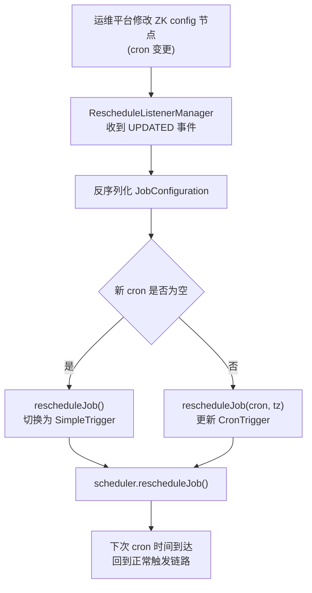

`rescheduleJob(cron, timeZone)`（`JobScheduleController.java:72-81`）仅当新 cron 与当前不同才重新调度，实现**改 cron 后动态生效，无需重启**。

### 6.6 misfire 机制

ElasticJob 有**两层 misfire**：

| 层 | 组件 | 触发时机 | 作用 |
|----|------|---------|------|
| Quartz 层 | `JobTriggerListener`（Quartz TriggerListener） | Quartz 判定 misfire 时 | 设置 `sharding/{item}/misfire` 节点 |
| ElasticJob 层 | `ExecutionService.misfireIfHasRunningItems` | 作业触发时上次还在运行 | 标记 misfire 并跳过本次 |

`JobTriggerListener.triggerMisfired()`（`JobTriggerListener.java:42-46`）在 `previousFireTime != null` 时调用 `executionService.setMisfire(localShardingItems)` 创建 `sharding/{item}/misfire` 节点。

在 `ElasticJobExecutor.execute()` 中正常执行后会循环检查 `isExecuteMisfired()`，若存在 misfire 标记则 `clearMisfire()` 后以 `MISFIRE` 来源补执行，直到清空。

### 6.7 触发完整时序

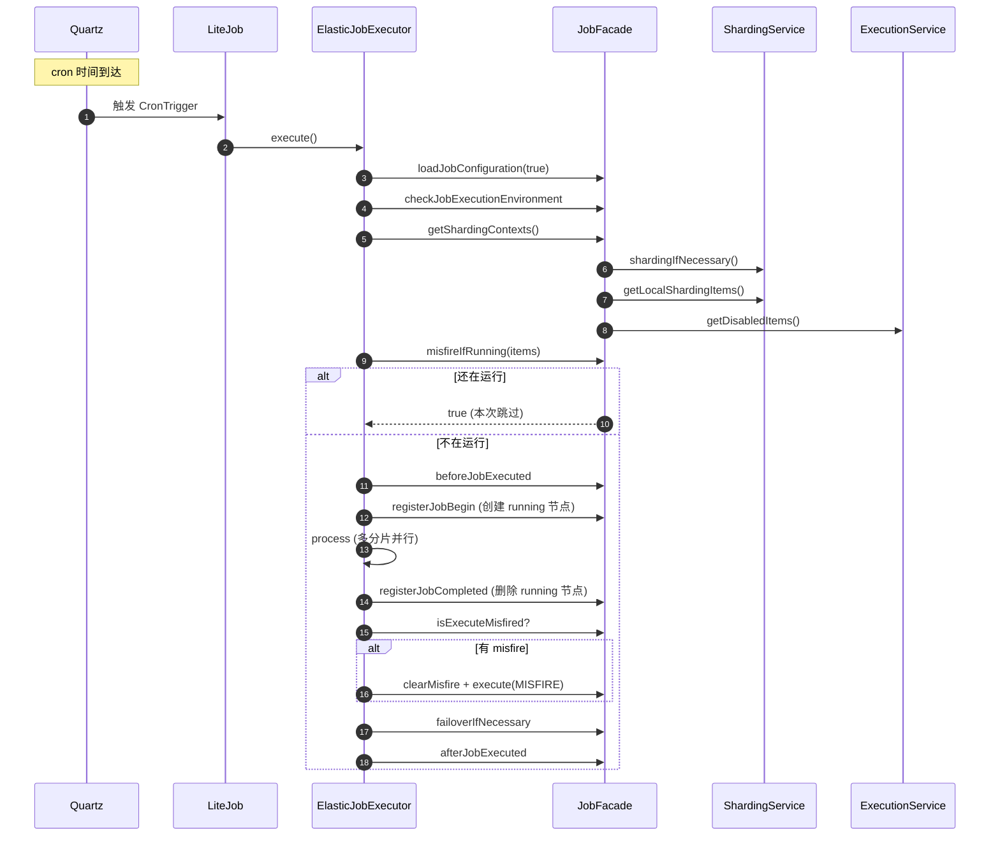

---

## 七、分片任务实现原理

### 7.1 分片整体设计

通过分片机制将一个作业拆分为多个**逻辑分片项（shardingItem）**，分配到不同实例并行执行。分片项是 0 到 `shardingTotalCount-1` 的整数，是纯逻辑概念，与具体节点无关。业务代码通过 `shardingItem` 决定处理哪部分数据（如 `shardingItem % 分表数` 决定操作哪张分表）。

`JobInstance`（`JobInstance.java:35`）的 `jobInstanceId` 格式为 `IP@-@PID`（`JobInstance.java:46`）。分片的核心就是：**将 N 个分片项分配给 M 个 JobInstance**，结果记录在 `/{jobName}/sharding/{item}/instance`（值为 jobInstanceId）。一个分片项在同一时刻只归属一个 JobInstance。

### 7.2 分片触发时机

`setReshardingFlag()`（`ShardingService.java:84-89`）只有主节点才会创建 `necessary` 标记节点。它被以下三处调用：

| 触发方 | 监听/检查 | 文件:行号 |
|--------|----------|----------|
| `ShardingListenerManager.ShardingTotalCountChangedJobListener` | config 节点变化且 shardingTotalCount 改变 | `ShardingListenerManager.java:77` |
| `ShardingListenerManager.ListenServersChangedJobListener` | instance/server 变化（上线/下线） | `ShardingListenerManager.java:89` |
| `ReconcileService.runOneIteration` | 定期检查有离线服务器分片信息 | `ReconcileService.java:60` |

> **静态分片优化**：`staticSharding=true` 且已有分片信息时，不触发重新分片，允许用户手动固定分片。

### 7.3 分片执行流程

`ShardingService.shardingIfNecessary()`（`ShardingService.java:108-126`）是分片核心：

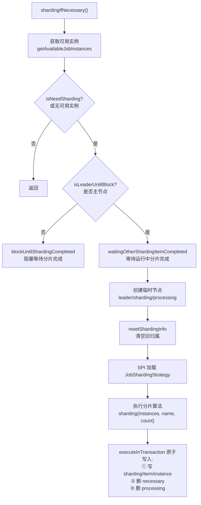

**关键点**：
- **只有主节点执行真正的分片计算**，非主节点走 `blockUntilShardingCompleted()`（`ShardingService.java:128-133`）循环等待 `necessary` 和 `processing` 节点消失；
- 主节点执行分片时创建临时节点 `processing` 标记分片进行中（主节点宕机自动消失）；
- `resetShardingInfo`（`ShardingService.java:142-153`）先删除所有 `sharding/{item}/instance` 清空旧归属；
- 分片结果 + 标志清理在**同一事务**中原子完成。

### 7.4 分片策略详解

所有策略实现 `JobShardingStrategy` 接口，通过 SPI 加载，返回 `Map<JobInstance, List<Integer>>`。

| 策略 | type | 算法 | 是否默认 |
|------|------|------|---------|
| `AverageAllocationJobShardingStrategy` | `AVG_ALLOCATION` | 整除分配 + 余数分配前 aliquant 个实例 | **是** |
| `OdevitySortByNameJobShardingStrategy` | `ODEVITY` | 按 jobName hashcode 奇偶性决定是否反转实例列表，再委托平均分配 | 否 |
| `RoundRobinByNameJobShardingStrategy` | `ROUND_ROBIN` | 按 jobName hashcode 计算偏移量旋转实例列表，再委托平均分配 | 否 |
| `SingleShardingBalanceJobShardingStrategy` | `SINGLE_SHARDING_BALANCE` | 偏移量加入 `System.currentTimeMillis()`，每次分片偏移不同，专为单分片作业轮转 | 否 |

**默认策略算法示例**（`AverageAllocationJobShardingStrategy`，`:53-77`）：
- 整除部分：3 实例 9 分片 → 实例0=[0,1,2], 实例1=[3,4,5], 实例2=[6,7,8]
- 余数部分：3 实例 8 分片 → 实例0=[0,1,6], 实例1=[2,3,7], 实例2=[4,5]

### 7.5 分片项参数

`ShardingItemParameters`（`ShardingItemParameters.java:33`）解析配置格式 `0=a,1=b,2=c`（分片项=参数，逗号分隔，等号分割 key-value，key 必须为整数）。结果存入 `Map<Integer, String>`，通过 `ShardingContexts` 传递给业务代码。

### 7.6 执行上下文构建

`ExecutionContextService.getJobShardingContext()`（`ExecutionContextService.java:57-67`）：
- `removeRunningIfMonitorExecution` 过滤掉正在运行的分片项；
- 加载 `shardingItemParameters` 配置；
- `getAssignedShardingItemParameterMap` 只保留本节点分片项对应的参数；
- taskId 格式：`jobName@-@shardingItems@-@READY@-@jobInstanceId`。

### 7.7 JobInstance 与 server/instance 节点

| 概念 | ZK 路径 | 节点类型 | 标识 | 生命周期 |
|------|---------|----------|------|---------|
| instance 节点 | `/{jobName}/instances/{instanceId}` | **临时** | jobInstanceId(IP@-@PID) | 实例上线创建，宕机自动删除 |
| server 节点 | `/{jobName}/servers/{ip}` | **持久** | server IP | 持久化，值为 ENABLED/DISABLED |
| JobInstance | instance 节点数据 | YAML 序列化 | jobInstanceId + serverIp | 内存对象 |

**分片依据 instance 节点**：`InstanceService.getAvailableJobInstances()`（`InstanceService.java:69-83`）遍历 `instances/` 子节点，并校验对应 server 已 ENABLED。同一 IP 多进程会产生多个 instance 节点（不同 PID），支持同机多实例。

---

## 八、如何保证同一时刻只有一个节点执行

ElasticJob 通过**两层机制**保证分片项粒度的互斥执行：

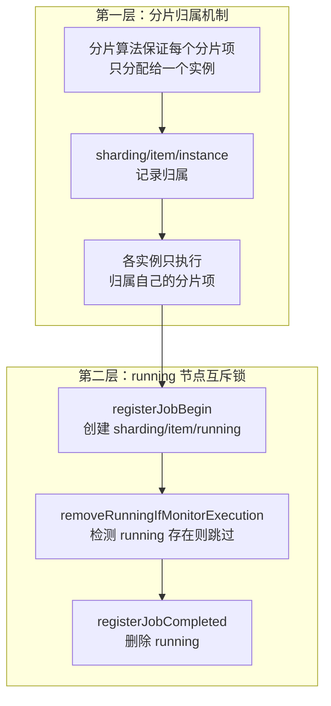

### 8.1 第一层：分片归属机制

分片结果写入 `/{jobName}/sharding/{item}/instance`（持久节点，值为 jobInstanceId）。由于分片算法保证每个分片项只分配给一个实例，各实例通过 `getLocalShardingItems()`（`ShardingService.java:220-225`）只读取归属自己的分片项。

但这只是"静态归属"——如果同一实例在 misfire 场景下被多次触发，仍可能并发执行同一分片项，因此需要第二层机制。

### 8.2 第二层：running 节点互斥（分片项粒度并发锁）

ZK 节点：`/{jobName}/sharding/{item}/running`（`ShardingNode.java:36`）

**何时创建**：`ExecutionService.registerJobBegin`（`ExecutionService.java:56-70`）在执行前调用，开启 `monitorExecution`（默认 true）时为每个分片项创建 running 节点：

- **failover=true**：用 `fillJobNode`（**持久节点**），实例崩溃后节点仍存在，供 failover 逻辑识别崩溃分片项；
- **failover=false**：用 `fillEphemeralJobNode`（**临时节点**），实例崩溃后 ZK session 失效自动删除。

**何时删除**：`ExecutionService.registerJobCompleted`（`ExecutionService.java:77-85`）在执行完成 finally 块中删除。

### 8.3 monitorExecution 如何防止同一分片项并发执行

`ExecutionContextService.removeRunningIfMonitorExecution`（`ExecutionContextService.java:76-87`）：

```java
for (int each : shardingItems) {
    if (isRunning(each)) {  // 检查 sharding/{item}/running 是否存在
        runningShardingItems.add(each);
    }
}
shardingItems.removeAll(runningShardingItems);  // 移除正在运行的分片项
```

完整互斥流程：
1. 节点 A 触发执行分片项 0：`registerJobBegin` 创建 `sharding/0/running`；
2. misfire 场景下节点 A 再次触发：`removeRunningIfMonitorExecution` 检测到分片项 0 的 running 节点存在 → 从执行列表移除；
3. `ElasticJobExecutor.execute` 检查 `shardingContexts.isEmpty()` 为空则直接返回，不执行；
4. 节点 A 执行完成：`registerJobCompleted` 删除 `sharding/0/running`。

### 8.4 misfire 防并发

`ExecutionService.misfireIfHasRunningItems`（`ExecutionService.java:165-171`）在 `ElasticJobExecutor.execute` 中调用：若有分片项正在运行，则设置 misfire 标记并跳过本次执行，待上次完成后补执行。

### 8.5 没有分片（shardingTotalCount=1）时的单节点执行保证

当 `shardingTotalCount=1` 时，只有一个分片项 0，分片策略会将其分配给某一个实例，只有该实例执行。

若希望单分片作业在多实例间**轮流执行**而非固定绑定，使用 `SingleShardingBalanceJobShardingStrategy` + `SingleShardingJobFacade`（`JobScheduler.java:86-91` 构造时判断）：
- 检查 `/{jobName}/next-job-instance-ip` 节点，若等于当前实例 IP 则执行；
- 执行完成后计算下一个实例 IP 并写入 `next-job-instance-ip`，实现轮转。

### 8.6 互斥节点总结

| ZK 节点 | 类型 | 创建时机 | 删除时机 | 作用 |
|---------|------|----------|----------|------|
| `sharding/{item}/instance` | 持久 | 分片事务写入 | 重新分片时清除 | 记录归属 |
| `sharding/{item}/running` | 临时/持久 | `registerJobBegin` | `registerJobCompleted` 或宕机 | **分片项粒度互斥锁** |
| `sharding/{item}/misfire` | 持久 | `setMisfire` | `clearMisfire` | 记录错过执行的分片项 |
| `leader/sharding/necessary` | 持久 | `setReshardingFlag` | 分片完成事务删除 | 触发重新分片 |
| `leader/sharding/processing` | 临时 | `shardingIfNecessary` | 分片完成事务删除 | 标记分片进行中 |

---

## 九、故障失效转移流程

### 9.1 失效转移与重新分片的区别

| 维度 | 失效转移 (Failover) | 重新分片 (Resharding) |
|------|---------------------|----------------------|
| 触发原因 | 某个节点运行中宕机 | 节点上下线、分片总数变更、配置变化 |
| 影响范围 | 仅崩溃节点的分片项 | 所有分片项重新分配 |
| ZK 标记 | `/leader/failover/items/{item}` | `/leader/sharding/necessary` |
| 执行时机 | 立即触发（`triggerJob`） | 下一次调度周期时 |
| 配置开关 | `failover=true` | 无需开关，自动触发 |

### 9.2 failover 配置开关的作用

`failover` 默认 `false`（`JobConfiguration.java:112`），**依赖 `monitorExecution=true`**。开关作用：

1. **运行节点类型不同**：failover=true 时 running 用持久节点（宕机后仍存在可识别崩溃分片），否则用临时节点；
2. **监听器前置判断**：`FailoverListenerManager.isFailoverEnabled()`（`FailoverListenerManager.java:83-85`）；
3. **执行入口判断**：`AbstractJobFacade.failoverIfNecessary()`（`AbstractJobFacade.java:101-105`）；
4. **分片上下文**：`ShardingJobFacade.getShardingContexts()` 优先获取本地 failover 项；
5. **配置变更清理**：failover 改为 false 时 `FailoverSettingsChangedJobListener` 清理所有 failover 信息。

### 9.3 触发时机

#### (1) 节点宕机触发（主要路径）

`FailoverListenerManager` 在 `start()`（`FailoverListenerManager.java:77-81`）注册三个监听器：`JobCrashedJobListener`、`FailoverSettingsChangedJobListener`、`LegacyCrashedRunningItemListener`。

`JobCrashedJobListener`（`FailoverListenerManager.java:87-111`）监听 instances 路径的 `DELETED` 事件，分两种情况：

- **宕机节点正在执行失效转移分片**（failovering 节点存在）：`getFailoveringItems` → `setCrashedFailoverFlagDirectly` → `clearRunningInfo` → `failoverIfNecessary`；
- **宕机节点正在执行正常分片**：`getCrashedShardingItems` → `setCrashedFailoverFlag` → `failoverIfNecessary`。

`ShardingService.getCrashedShardingItems()`（`ShardingService.java:196-209`）遍历所有分片项，找出 `sharding/{item}/running` 存在且 `sharding/{item}/instance` 值等于宕机 instanceId 的分片项。

#### (2) 遗留崩溃运行项监听（补偿机制）

`LegacyCrashedRunningItemListener`（`FailoverListenerManager.java:123-164`）处理 ZK 事件丢失的情况：当前实例上线且为唯一在线实例时，检查所有 failovering/running 节点，若其 instance 不在可用实例中则重新设置标记，触发失效转移。

> **源码事实纠正**：在当前版本中，**单个分片项执行抛异常并不会直接触发失效转移**。`process()` 中异常仅被记录并交给 `JobErrorHandler`，不调用 `setCrashedFailoverFlag`。`failoverIfNecessary()` 是在每次作业执行**完成后**调用的常规检查，检查是否有其他节点宕机遗留的待处理项。

### 9.4 失效转移核心流程

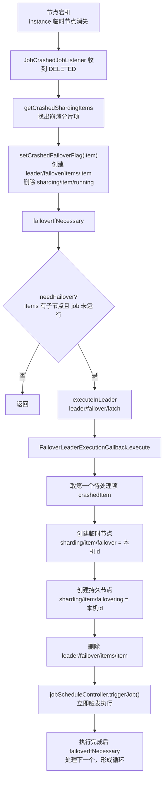

`FailoverLeaderExecutionCallback.execute()`（`FailoverService.java:214-232`）每次只处理**一个**分片项（`get(0)`），处理完通过 `triggerJob` 触发执行，执行完成后 `ElasticJobExecutor` 再次调用 `failoverIfNecessary()` 处理下一个，形成循环。

### 9.5 FailoverNode 节点结构

| ZK 路径 | 类型 | 含义 |
|---------|------|------|
| `/leader/failover/latch` | Leader 锁节点 | 保证只有一个节点执行失效转移分配 |
| `/leader/failover/items/{item}` | 持久 | 标记分片项需失效转移（空值） |
| `/sharding/{item}/failover` | **临时** | 标记已被接管，值为 jobInstanceId。接管节点宕机自动消失 |
| `/sharding/{item}/failovering` | **持久** | 记录正在执行失效转移的 instance。宕机后仍保留，可检测执行者崩溃 |

> **failover（临时）与 failovering（持久）的设计差异是有意为之**：
> - `failover` 临时：接管节点宕机自动消失，`isFailoverAssigned` 返回 false，允许重新分配；
> - `failovering` 持久：宕机后仍保留，`JobCrashedJobListener` 可据此发现"失效转移执行者也崩溃了"，触发二次失效转移。

### 9.6 失效转移后的执行

`ShardingJobFacade.getShardingContexts()`（`ShardingJobFacade.java:76-91`）：

1. 若 failover 开启，**优先**检查 `getLocalFailoverItems()`（`sharding/{item}/failover` 值为当前 instanceId 的分片项）；
2. 若有失效转移分片项，直接返回这些项的上下文，**跳过正常分片流程**；
3. 若无，走正常分片流程，但排除 `getLocalTakeOffItems()`（已分配给其他节点失效转移的分片项，使原归属节点跳过）。

> **源码事实纠正**：失效转移执行与正常执行在执行流程上**没有本质区别**，都走 `ExecutionSource.NORMAL_TRIGGER`。`ExecutionSource.FAILOVER` 枚举已定义但**未被使用**；`ExecutionType.FAILOVER` 已定义但 `buildTaskId()` 始终硬编码使用 `"READY"`。

### 9.7 失效转移完成清理

`AbstractJobFacade.registerJobCompleted()`（`AbstractJobFacade.java:123-128`）：

```java
executionService.registerJobCompleted(shardingContexts);  // 删除 running
if (configService.load(true).isFailover()) {
    failoverService.updateFailoverComplete(shardingContexts.getShardingItemParameters().keySet());
}
```

`updateFailoverComplete`（`FailoverService.java:104-109`）删除 `sharding/{item}/failover` 和 `sharding/{item}/failovering`，表示失效转移已完成。

### 9.8 完整失效转移时序

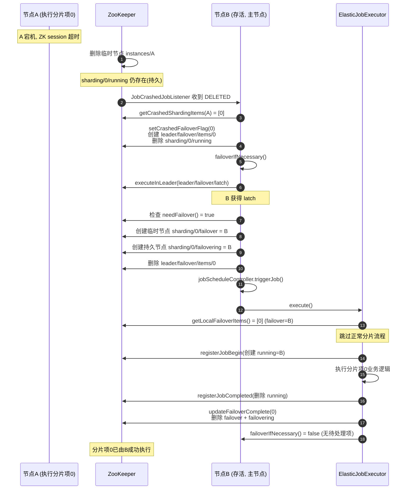

### 9.9 失效转移执行者也崩溃

若 B 在执行分片项 0 时也崩溃：
- `sharding/0/failover`（临时节点）自动消失；
- `sharding/0/failovering`（持久节点）仍保留且值为 B 的 instanceId；
- 其他节点检测到 B 的 instance 消失后，`JobCrashedJobListener` 中 `getFailoveringItems(B)` 返回 [0]；
- 使用 `setCrashedFailoverFlagDirectly(0)` 直接重新标记，触发**二次失效转移**。

---

## 十、协调服务 ReconcileService

### 10.1 定时任务机制

`ReconcileService`（`reconcile/ReconcileService.java:33-77`）继承 Guava `AbstractScheduledService`，每 **1 分钟**执行一次 `runOneIteration()`（`ReconcileService.java:74-76`）。在 `SetUpFacade.registerStartUpInfo()` 中 `startAsync()` 启动。

### 10.2 协调逻辑

`runOneIteration()`（`ReconcileService.java:54-63`）：

1. **频率控制**：`reconcileIntervalMinutes` 默认 10 分钟（`JobConfiguration.java:118`），设为 0 或负数则禁用；
2. **触发条件**（三个同时满足）：
   - 当前不需要重新分片（`!isNeedSharding()`）；
   - 存在离线服务器的分片信息（`hasShardingInfoInOfflineServers()`）；
   - 非静态分片或无分片信息；
3. **动作**：`setReshardingFlag()` 设置重新分片标志。

`hasShardingInfoInOfflineServers()`（`ShardingService.java:232-241`）遍历所有分片项，若 `sharding/{item}/instance` 的值不在当前 `instances` 子节点列表中，说明分片信息指向已下线服务器。

> **源码事实纠正**：`ReconcileService` 在当前版本中**不直接处理失效转移**，只检测分片信息不一致并触发**重新分片（resharding）**。失效转移的不一致修复由 `LegacyCrashedRunningItemListener` 负责。

### 10.3 与 failover/resharding 的配合

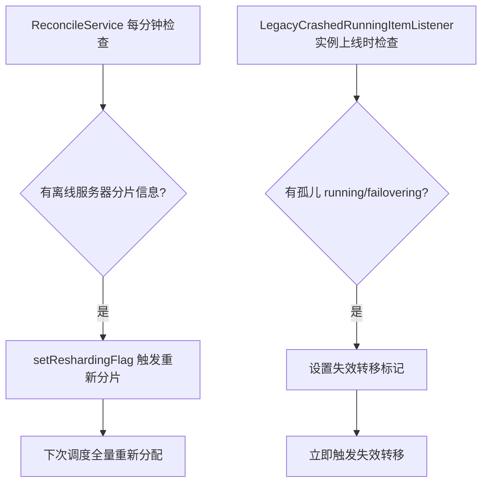

---

## 十一、其他底层实现补充

### 11.1 保证机制 GuaranteeService（分布式 once 协调）

`GuaranteeService`（`guarantee/GuaranteeService.java`）实现"所有分片都启动后才执行前置逻辑"和"所有分片都完成后才执行后置逻辑"的分布式协调。

**机制**：每个分片启动后创建 `guarantee/started/{item}`，完成时创建 `guarantee/completed/{item}`。当子节点数 == `shardingTotalCount` 时表示全部启动/完成。

**配合 `AbstractDistributeOnceElasticJobListener`**（`listener/AbstractDistributeOnceElasticJobListener.java`）：
- `beforeJobExecuted`：`registerStart` → 等待 → 若是最后一个启动则 `executeInLeaderForLastStarted` 在主节点执行一次 `doBeforeJobExecutedAtLastStarted`；
- `afterJobExecuted`：对称逻辑，使用 completed 节点。

`GuaranteeListenerManager` 监听 started/completed 根节点删除事件唤醒等待线程。**用途场景**：所有分片准备就绪后才开始处理（如数据初始化），或所有分片处理完毕后才做汇总输出。

### 11.2 Tracing 作业追踪

基于 Guava EventBus 实现，定义两种事件：
- `JobExecutionEvent`（执行事件）：含 source(`NORMAL_TRIGGER`/`MISFIRE`/`FAILOVER`)、shardingItem、startTime/completeTime、success、failureCause；
- `JobStatusTraceEvent`（状态追踪事件）：含 state 枚举（`TASK_STAGING`/`TASK_RUNNING`/`TASK_FINISHED`/`TASK_FAILED`/...）。

`JobTracingEventBus`（`tracing/event/JobTracingEventBus.java`）使用静态线程池（`availableProcessors * 2`）+ `AsyncEventBus` 异步分发。`TracingListener` SPI 通过 `@Subscribe` + `@AllowConcurrentEvents` 接收事件，将执行日志写入外部存储（如 RDB）。

**与 ElasticJobListener 的区别**：

| 维度 | ElasticJobListener | TracingListener |
|------|-------------------|-----------------|
| 定位 | 用户级业务监听器 | 系统级作业追踪 |
| 执行方式 | 同步（作业线程中） | 异步（独立 EventBus 线程池） |
| 数据流 | ZK（guarantee 节点协调） | 外部存储（如数据库） |
| 典型用途 | 分布式开始/完成协调 | 作业执行日志写入数据库 |

### 11.3 线程池机制

`ElasticJobExecutorService`（`executor/threadpool/ElasticJobExecutorService.java`）封装分片项执行线程池：固定大小（core==max==threadSize）、`LinkedBlockingQueue` 无界、核心线程空闲 5 分钟回收、JVM 关闭时优雅退出。

| 线程池大小提供者 | type | 策略 | 默认 |
|----------------|------|------|------|
| `CPUUsageJobExecutorThreadPoolSizeProvider` | `CPU` | `availableProcessors * 2` | **是** |
| `SingleThreadJobExecutorThreadPoolSizeProvider` | `SINGLE_THREAD` | `1` | 否 |

`ExecutorServiceReloader`（`executor/threadpool/ExecutorServiceReloader.java`）支持配置变更后热重载（关闭旧线程池 → 创建新线程池）。

### 11.4 错误处理 JobErrorHandler

`JobErrorHandler`（`api/.../spi/executor/error/handler/JobErrorHandler.java`）继承 `TypedSPI, Closeable`：

| 实现 | type | 行为 | 默认 |
|------|------|------|------|
| `LogJobErrorHandler` | `LOG` | 记录异常日志 | **是** |
| `ThrowJobErrorHandler` | `THROW` | 抛出异常中断作业 | 否 |
| `IgnoreJobErrorHandler` | `IGNORE` | 忽略异常 | 否 |
| `EmailJobErrorHandler`/`DingtalkJobErrorHandler`/`WechatJobErrorHandler` | 邮件/钉钉/微信 | 通知 | 否 |

`JobErrorHandlerReloader` 支持 `jobErrorHandlerType` 或 `props` 变化时热重载；`JobErrorHandlerPropertiesValidator` SPI 校验错误处理器特有属性（如 SMTP 配置）。

### 11.5 快照服务 SnapshotService

`SnapshotService`（`snapshot/SnapshotService.java`）通过 TCP 端口监听提供 dump 功能：
- 启动时创建 `ServerSocket(port)`，在独立线程 `elasticjob-snapshot-service-{port}` 中循环 accept；
- 客户端发送 `dump@{jobName}` 命令；
- `dumpDirectly` 递归遍历 `/{jobName}` 下所有子节点，对每个节点同时读取 **ZK 真实值**和**本地缓存值**，用于诊断缓存与 ZK 不一致问题；
- 输出经 `SensitiveInfoUtils.filterSensitiveIps()` 脱敏处理，供 ElasticJob-Console 调用。

### 11.6 配置持久化与 YAML

`ConfigurationService`（`config/ConfigurationService.java`）负责配置持久化：
- `setUpJobConfiguration`（`:73`）：检查冲突 → 若节点不存在或 overwrite=true 则 `YamlEngine.marshal` 写入 `/{jobName}/config`，否则返回 ZK 现有配置（"ZK 优先"语义）；
- `load(fromCache)`（`:49-64`）：支持缓存读取与直接读取双模式。

`JobConfigurationPOJO` 是 YAML 序列化 POJO，通过 `fromJobConfiguration`/`toJobConfiguration` 与 `JobConfiguration` 双向转换。`YamlEngine`（`infra/yaml/YamlEngine.java`）基于 SnakeYAML，反序列化时通过 `LoaderOptions` 限制只允许 `org.apache.shardingsphere.elasticjob` 包名的类（安全防护）。

### 11.7 ZK 异常处理与容错

`RegExceptionHandler`（`registry-center/api/.../reg/exception/RegExceptionHandler.java`）三类处理策略：
1. **可忽略异常**：仅 debug 日志，不抛出——保证 ZK 临时中断容错；
2. **InterruptedException**：恢复中断标志，不抛出；
3. **其他异常**：包装为 `RegException` 抛出。

可忽略异常通过 SPI 动态加载（`IgnoredExceptionProvider`）。`ZookeeperCuratorIgnoredExceptionProvider` 定义三种可忽略异常：`ConnectionLossException`（连接丢失）、`NoNodeException`（节点不存在）、`NodeExistsException`（节点已存在）。这些在 ZK 临时中断（网络抖动、session 重连）时常见，忽略它们保证容错性。

### 11.8 节点优雅下线

**被动下线**：`ShutdownListenerManager`（`instance/ShutdownListenerManager.java`）监听本机 instance 节点被删除事件（ZK session 过期但进程仍在运行），触发 `SchedulerFacade.shutdownInstance()`：若是主节点则 `removeLeader` → `JobRegistry.shutdown()`。

**主动关闭**：`JobScheduler.shutdown()`（`JobScheduler.java:201-206`）：`setUpFacade.tearDown()`（移除监听器、停止 ReconcileService）→ `schedulerFacade.shutdownInstance()`（移除 leader、关闭调度器）→ `jobScheduleController.shutdown(false)` → `jobExecutor.shutdown()`（关闭线程池和错误处理器）。

### 11.9 设计模式总结

| 设计模式 | 应用 |
|---------|------|
| 门面模式 | `SchedulerFacade`/`SetUpFacade`/`JobFacade` 封装复杂子系统 |
| 监听器模式 | `ListenerManager` 体系（ZK 数据监听）+ `ElasticJobListener`（业务监听） |
| SPI 机制 | `JobItemExecutor`/`JobErrorHandler`/`JobShardingStrategy`/`ElasticJobListener`/`TracingListener`/`IgnoredExceptionProvider` 等 |
| Builder 模式 | `JobConfiguration` 链式配置 20+ 属性 |
| 单例模式 | `JobRegistry` 双重检查锁，全局管理作业状态 |
| 模板方法 | `AbstractJobFacade` 实现 `JobFacade` 大部分方法，`getShardingContexts()` 抽象由子类实现 |
| 策略模式 | `JobShardingStrategy` 可替换分片策略 |
| 观察者模式 | `JobTracingEventBus` 基于 Guava EventBus，`@Subscribe` 异步追踪 |
| 工厂模式 | `JobItemExecutorFactory`/`JobClassNameProviderFactory`/`JobAPIFactory` |

---

## 十二、源码事实纠正与注意事项

源码分析过程中发现以下常见误解，特此纠正：

| 序号 | 常见误解 | 源码事实 |
|------|---------|---------|
| 1 | 存在 `triggerInterval` 字段实现定时间隔触发 | **不存在**。`JobConfiguration` 只有 `cron`/`timeZone`，trigger 包实现的是基于 ZK 节点的一次性手动触发 |
| 2 | 执行标记在 `/{jobName}/execution/{item}` | **不存在**。3.x 实际在 `/{jobName}/sharding/{item}/running` |
| 3 | 单个分片项执行异常会触发失效转移 | **不会**。异常仅记录并交给 `JobErrorHandler`，不设置 failover 标记 |
| 4 | 失效转移执行走 `ExecutionSource.FAILOVER` | **未使用**。`FAILOVER` 枚举已定义但失效转移执行也走 `NORMAL_TRIGGER` |
| 5 | 失效转移 taskId 标记为 `FAILOVER` | **始终硬编码 `READY`**。`ExecutionType.FAILOVER` 已定义但 `buildTaskId()` 用 `"READY"` |
| 6 | `ReconcileService` 处理失效转移 | **不直接处理**。只检测离线分片信息触发重新分片，failover 修复由 `LegacyCrashedRunningItemListener` 负责 |
| 7 | `failoverIfNecessary()` 仅在失败时调用 | **每次作业执行完成后都调用**，是常规检查逻辑 |
| 8 | 作业正在运行时触发会堆叠执行 | **当前不支持**。trigger 监听器检查 `isJobRunning`，正在运行则忽略（源码 TODO 表明未来支持堆叠） |
| 9 | `sharding/{item}/failover` 是持久节点 | **临时节点**（`fillEphemeralJobNode`）；`sharding/{item}/failovering` 才是持久节点（`fillJobNode`） |
| 10 | `ZookeeperElectionService` 用于实际选主 | **生产代码未使用**。实际选主走 `LeaderService` + `LeaderLatch` + 临时节点 |

---

## 附录：关键源码文件索引

### 入口与配置
- `bootstrap/src/main/java/org/apache/shardingsphere/elasticjob/bootstrap/type/ScheduleJobBootstrap.java`
- `bootstrap/src/main/java/org/apache/shardingsphere/elasticjob/bootstrap/type/OneOffJobBootstrap.java`
- `api/src/main/java/org/apache/shardingsphere/elasticjob/api/JobConfiguration.java`
- `api/src/main/java/org/apache/shardingsphere/elasticjob/api/ElasticJob.java`

### 调度核心
- `kernel/src/main/java/org/apache/shardingsphere/elasticjob/kernel/internal/schedule/JobScheduler.java`
- `kernel/.../schedule/LiteJob.java`
- `kernel/.../schedule/JobScheduleController.java`
- `kernel/.../schedule/JobRegistry.java`
- `kernel/.../schedule/JobTriggerListener.java`
- `kernel/.../schedule/JobShutdownHookPlugin.java`

### 门面
- `kernel/.../internal/setup/SetUpFacade.java`
- `kernel/.../internal/schedule/SchedulerFacade.java`
- `kernel/.../executor/facade/AbstractJobFacade.java`
- `kernel/.../executor/facade/ShardingJobFacade.java`
- `kernel/.../executor/facade/SingleShardingJobFacade.java`

### 执行器
- `kernel/.../executor/ElasticJobExecutor.java`
- `kernel/.../executor/item/JobItemExecutorFactory.java`

### 各 Service
- `kernel/.../internal/config/ConfigurationService.java`
- `kernel/.../internal/election/LeaderService.java`
- `kernel/.../internal/election/ElectionListenerManager.java`
- `kernel/.../internal/sharding/ShardingService.java`
- `kernel/.../internal/sharding/ExecutionContextService.java`
- `kernel/.../internal/sharding/ExecutionService.java`
- `kernel/.../internal/sharding/ShardingListenerManager.java`
- `kernel/.../internal/sharding/strategy/type/AverageAllocationJobShardingStrategy.java`
- `kernel/.../internal/server/ServerService.java`
- `kernel/.../internal/instance/InstanceService.java`
- `kernel/.../internal/failover/FailoverService.java`
- `kernel/.../internal/failover/FailoverListenerManager.java`
- `kernel/.../internal/trigger/TriggerService.java`
- `kernel/.../internal/trigger/TriggerListenerManager.java`
- `kernel/.../internal/reconcile/ReconcileService.java`
- `kernel/.../internal/guarantee/GuaranteeService.java`
- `kernel/.../internal/snapshot/SnapshotService.java`

### 监听器与存储
- `kernel/.../internal/listener/ListenerManager.java`
- `kernel/.../internal/listener/AbstractListenerManager.java`
- `kernel/.../internal/listener/ListenerNotifierManager.java`
- `kernel/.../internal/listener/RegistryCenterConnectionStateListener.java`
- `kernel/.../internal/storage/JobNodePath.java`
- `kernel/.../internal/storage/JobNodeStorage.java`

### 注册中心
- `registry-center/api/src/main/java/org/apache/shardingsphere/elasticjob/reg/base/CoordinatorRegistryCenter.java`
- `registry-center/provider/zookeeper-curator/src/main/java/org/apache/shardingsphere/elasticjob/reg/zookeeper/ZookeeperRegistryCenter.java`
- `registry-center/api/src/main/java/org/apache/shardingsphere/elasticjob/reg/exception/RegExceptionHandler.java`

### SPI 接口
- `api/src/main/java/org/apache/shardingsphere/elasticjob/spi/executor/item/JobItemExecutor.java`
- `api/src/main/java/org/apache/shardingsphere/elasticjob/spi/executor/error/handler/JobErrorHandler.java`
- `api/src/main/java/org/apache/shardingsphere/elasticjob/spi/listener/ElasticJobListener.java`
- `api/src/main/java/org/apache/shardingsphere/elasticjob/spi/tracing/listener/TracingListener.java`

---

> 本文档基于 ElasticJob 3.0.5/3.1.0-SNAPSHOT 源码分析整理，涵盖了整体架构、工作流程、ZK 数据结构、选主、通信机制、定时触发、分片、单节点执行保证、失效转移、协调服务等核心机制，并补充了 Tracing、线程池、错误处理、快照、配置持久化、ZK 容错等底层实现。所有结论均标注了源码文件路径与行号，便于追溯验证。
